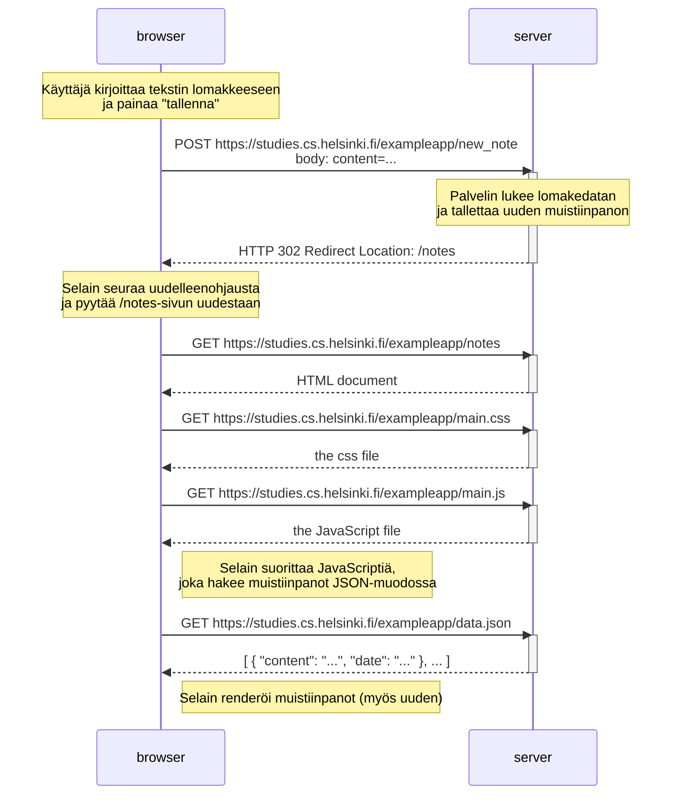

```mermaid
sequenceDiagram
    participant browser
    participant server

    Note over browser: Käyttäjä kirjoittaa tekstin lomakkeeseen<br/>ja painaa "tallenna"

    browser->>server: POST https://studies.cs.helsinki.fi/exampleapp/new_note<br/>body: content=...
    activate server
    Note over server: Palvelin lukee lomakedatan<br/>ja tallettaa uuden muistiinpanon
    server-->>browser: HTTP 302 Redirect Location: /notes
    deactivate server

    Note over browser: Selain seuraa uudelleenohjausta<br/>ja pyytää /notes-sivun uudestaan

    browser->>server: GET https://studies.cs.helsinki.fi/exampleapp/notes
    activate server
    server-->>browser: HTML document
    deactivate server

    browser->>server: GET https://studies.cs.helsinki.fi/exampleapp/main.css
    activate server
    server-->>browser: the css file
    deactivate server

    browser->>server: GET https://studies.cs.helsinki.fi/exampleapp/main.js
    activate server
    server-->>browser: the JavaScript file
    deactivate server

    Note right of browser: Selain suorittaa JavaScriptiä,<br/>joka hakee muistiinpanot JSON-muodossa

    browser->>server: GET https://studies.cs.helsinki.fi/exampleapp/data.json
    activate server
    server-->>browser: [ { "content": "...", "date": "..." }, ... ]
    deactivate server

    Note right of browser: Selain renderöi muistiinpanot (myös uuden)
```
