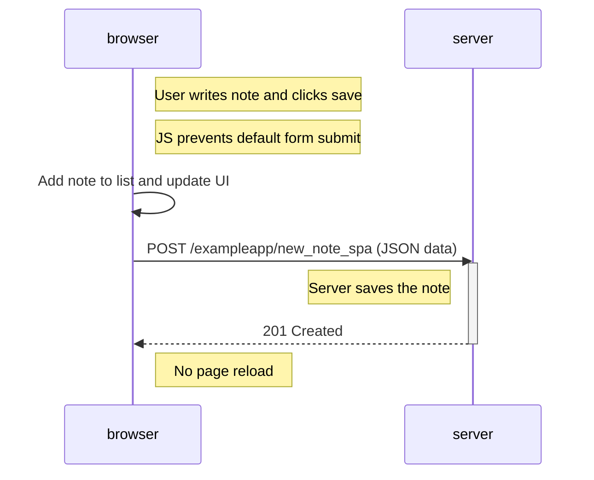

```mermaid
sequenceDiagram
    participant browser
    participant server

    Note right of browser: User writes note and clicks save

    Note right of browser: JS prevents default form submit

    browser->>browser: Add note to list and update UI

    browser->>server: POST /exampleapp/new_note_spa (JSON data)
    activate server
    Note left of server: Server saves the note
    server-->>browser: 201 Created
    deactivate server

    Note right of browser: No page reload
```
